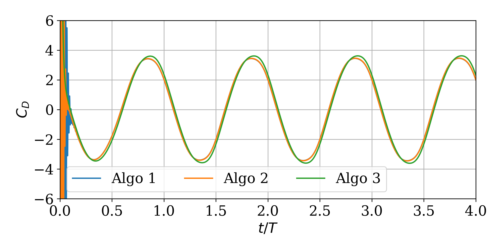
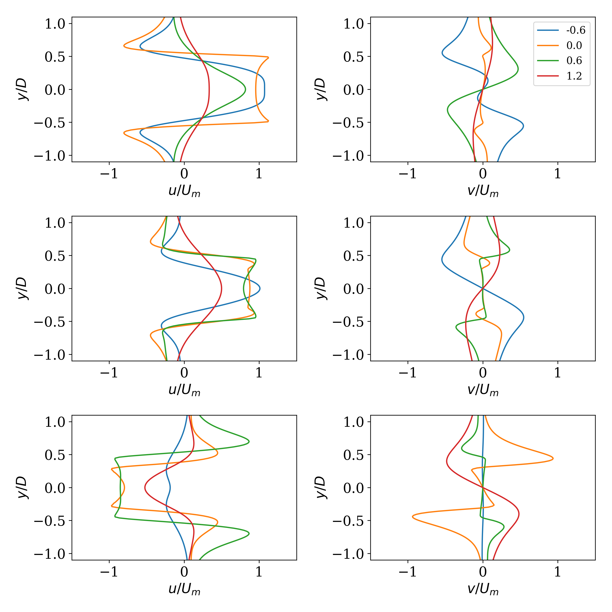

# Inline oscillating cylinder (Re=100 and KC=5)

**Figure 1:** History of the drag coefficient over 4 cylinder oscillations obtained with algorithms 1, 2, and 3 (using the scheme 3 to predict the Lagrangian momentum forcing at the beginning of each time step).

**Figure 2:** Velocity components (u: left; v: right) along vertical line at four cross-sections and different phase angles: (top) 180 deg, (middle) 210 deg, and (bottom) 330 deg.